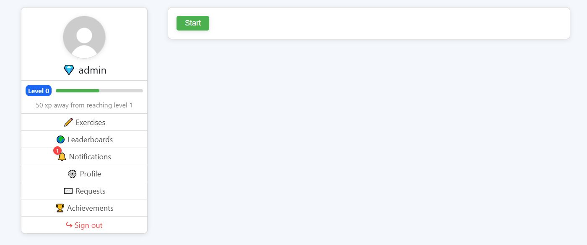
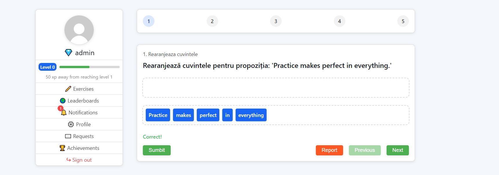
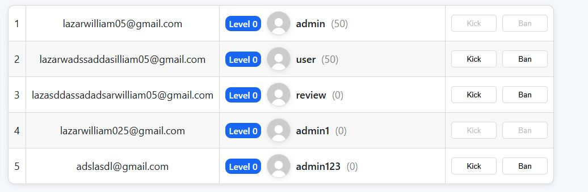

# 🧠 Learn English — Full-Stack Web Platform (Flask + React)

> An interactive web application for learning English, built entirely from scratch using **Flask (Python)** for the backend and **React (JavaScript)** for the frontend.  
> The platform combines dynamic exercises, gamification, role-based management, and notifications to deliver a complete and engaging language learning experience.

---

## 🚀 Overview

### 🧑‍🎓 User Features
- Practice exercises with multiple types and difficulties  
- Earn XP and unlock achievements  
- Track progress and streaks  
- Receive notifications for achievements, feedback, and system updates  
- Request reviewers for submitted exercises

### 🧑‍🏫 Reviewer Features
- Manage and approve user exercise submissions  
- Edit, update, or delete exercises  
- Approve or reject reviewer requests  
- Send notifications to users about review outcomes  

### 🛡️ Admin Features
- Manage all users (view, ban, unban, or delete)  
- Approve or reject **role upgrade requests**  
- View and manage reviewer and role requests  
- Full access to the database and notifications  

---

## 🧩 Tech Stack

| Layer | Technology |
|-------|-------------|
| **Frontend** | React.js (JavaScript, JSX, Hooks, Context API) |
| **Backend** | Flask (Python), Flask-JWT-Extended, SQLAlchemy |
| **Database** | SQLite (auto-created) |
| **Auth** | JWT-based Authentication & Authorization |
| **Styling** | CSS / Tailwind (if configured) |
| **API Communication** | Axios / Fetch (JSON REST APIs) |
| **Environment Config** | `config.json` + environment variables |

---

## ⚙️ Installation & Setup

### 🖥️ Backend Setup (Flask)
```bash
# Navigate to backend folder
cd backend

# (Optional) Create virtual environment
python -m venv venv
source venv/bin/activate  # on macOS/Linux
venv\Scripts\activate     # on Windows

# Install dependencies
pip install -r requirements.txt

# Run the backend
python app.py
```

By default, the app runs on http://127.0.0.1:5000/.

### 💻 Frontend Setup (React)
```bash
# Navigate to frontend folder
cd frontend

# Install dependencies
npm install

# Start frontend
npm start
```

The React app will start on http://localhost:3000/.

### 🗄️ Automatic Database Creation

The backend automatically creates the database if it doesn’t exist, using this snippet in app.py:

```python
with app.app_context():
    db.create_all()
```
This ensures that all tables (Users, Exercises, Notifications, Achievements, etc.) are initialized upon the first run.

## 🌐 CORS (Cross-Origin Resource Sharing)

CORS is enabled in the backend using:
```python
from flask_cors import CORS
CORS(app)
```

🔸 Why CORS?

CORS (Cross-Origin Resource Sharing) allows the frontend (React, usually on port 3000) to securely communicate with the Flask backend (port 5000).  
Without it, browsers would block API requests due to cross-origin restrictions.


### 🔐 Authentication & Route Protection

Authentication is handled using **JWT (JSON Web Tokens)** issued upon successful login.

* **Token Management**: Tokens are stored securely in the browser's `localStorage` and attached to every API request for authorization.
* **Backend Restriction**: **Role-based decorators** (`@token_required`, `@role_required`) restrict access to sensitive API endpoints based on the user's current role (e.g., 'admin', 'reviewer').
* **Frontend Protection**:
    * The **`ProtectedRoute`** component ensures that pages are only accessible by logged-in users.
    * **`AuthContext`** (React Context) stores global user authentication data (user info and token), which `ProtectedRoute` uses to redirect unauthorized users (e.g., non-admins) away from restricted routes.
* **Token Interceptor (Frontend)**: An interceptor automatically attaches the stored token to all outgoing requests.

```javascript
// Token interceptor (frontend/api.js)
api.interceptors.request.use((config) => {
  const token = localStorage.getItem('token');
  if (token) config.headers.Authorization = `Bearer ${token}`;
  return config;
});
```
---


### 📚 Exercise System (Gamified Learning)

* **Dynamic Fetching**: Exercises are fetched dynamically based on selected **difficulty** and the user's current **level**.
* **Multiple Types**: Supports multiple question formats: **multiple choice**, **text input**, and **drag-and-drop** (for re-arranging items).
* **Instant Feedback**: Feedback is provided instantly with correct/incorrect validation.
* **Gamification Integration**: **XP** and **achievements** are automatically calculated and updated by the backend upon completion.
* **Reviewer Management**: Reviewers can manage questions, **approve user submissions**, and **flag errors** for correction.

## ⚙️ Technologies Used

### 🔧 Backend
- **Flask** — lightweight backend framework.
- **SQLAlchemy** — ORM for database interaction.
- **Flask-CORS** — enables frontend-backend communication.
- **PyJWT** — secure JWT authentication.
- **SQLite** — local database (easily replaceable with PostgreSQL/MySQL).


### 💻 Frontend
- **React** — dynamic and modular user interface.
- **Axios** — HTTP client for backend API communication.
- **React Router DOM** — handles navigation and route protection.
- **Context API** — manages authentication state globally.
- **React Hooks (useState, useEffect, useContext)** — state and lifecycle management.

---

## 🧠 Technical Motivation

- **Flask** was chosen for its simplicity, control, and fast setup.
- **React** provides a modern, component-based interface.
- Separation of concerns between frontend and backend increases scalability.
- **CORS + Axios** ensures smooth and secure communication between layers.
- **JWT + Context API** enables persistent and secure authentication.

---

## 🧱 Project Architecture


```plaintext
project/
│
├── backend/
│   ├── app.py
│   ├── models.py
│   ├── auth.py
│   ├── config.json
│   ├── instance/
│   │   └── duolingo_db.sqlite3
│   ├── routes/
│   │   ├── user_routes.py
│   │   ├── reviewer_routes.py
│   │   └── admin_routes.py
│   └── __init__.py
│
└── frontend/
    ├── package.json
    ├── node_modules/
    ├── public/
    │   ├── index.html
    │   └── favicon.ico
    ├── src/
    │   ├── App.js
    │   ├── api.js
    │   ├── index.js
    │   ├── components/
    │   │   ├── Questions.js
    │   │   ├── Reviewer.js
    │   │   ├── AdminRequests.js
    │   │   ├── ProtectedRoute.js
    │   │   ├── Login.js
    │   │   └── Register.js
    └── README.md
```


---


### 🧠 Core Backend Components

| File | Role | Key Responsibilities |
| :--- | :--- | :--- |
| **`app.py`** | Initialization | Initializes the Flask app, database, and CORS. Registers blueprints for different user roles. Handles automatic DB creation. |
| **`auth.py`** | Authentication | Manages JWT creation and decoding. Provides decorators for authentication and role-based authorization (`@token_required`, `@role_required`). |
| **`models.py`** | Data Schema | Defines all main entities: <br/>- **User**: Stores credentials, XP, role, streaks. <br/>- **Exercise**: Contains question data and correct answers. <br/>- **Notification**: Messages for users (e.g. achievements, approvals). <br/>- **ReviewerRequest**: User requests to be reviewed. <br/>- **Achievement** / **UserAchievement**: Progress and rewards system. <br/>- **RoleRequest**: System for requesting admin/reviewer roles. |
| **`routes/`** | API Endpoints | Contains blueprints for specific functionalities: <br/>- **`admin_routes.py`**: Admin endpoints for user management and role handling. <br/>- **`reviewer_routes.py`**: CRUD operations for exercises, reviewer approvals. <br/>- **`user_routes.py`**: Notifications, achievements, and reviewer request endpoints. |


### 🔗 Example API Endpoints

| Role | Method | Endpoint | Description |
| :--- | :--- | :--- | :--- |
| **Admin** | `GET` | `/api/admin/users` | Get all users |
| **Admin** | `POST` | `/api/admin/ban_user` | Ban a user |
| **Admin** | `POST` | `/api/admin/unban_user` | Unban a user |
| **Reviewer** | `GET` | `/api/reviewer/exercises` | List exercises |
| **Reviewer** | `PUT` | `/api/reviewer/exercises/<id>` | Edit exercise |
| **Reviewer** | `DELETE` | `/api/reviewer/exercises/<id>` | Delete exercise |
| **User** | `POST` | `/api/reviewer_requests` | Create reviewer request |
| **User** | `GET` | `/api/notifications/<id>` | Get notifications |


## 🧪 Testing (Unit & Integration Tests)

Comprehensive **unit and integration tests** are implemented to ensure backend reliability and code quality.  
Testing focuses on **authentication**, **role-based access**, **user registration**, **file uploads**, and **core API endpoints**.

### 🔍 Testing Frameworks & Tools
- **pytest** — main testing framework  
- **freezegun** — simulates time-based token expiration  
- **Flask test client** — for integration testing of API endpoints

### 🧠 Test Structure

| File | Purpose |
|------|----------|
| **`conftest.py`** | Global pytest configuration and reusable client fixture that sets up a temporary SQLite database before each test. |
| **`test_app.py`** | Tests for user registration, login, file upload, and leaderboard logic. |
| **`test_auth.py`** | Unit tests for JWT generation/verification and integration tests for protected routes. |

### ✅ Test Types
- **Unit Tests** — Validate isolated functionality such as token generation and allowed file types.  
- **Integration Tests** — Verify correct interaction between Flask routes, models, and authentication logic.  
  Examples include:
  - Registering and logging in a user
  - Validating JWT tokens and access control
  - Uploading files and verifying leaderboard data
  - Role-based access validation (`admin`, `reviewer`, `user`)

### 🧭 Running Tests
From the **backend directory**, run:
```bash
pytest -v
```


### 🏆 Achievements & Gamification

* **XP** and **streak-based** progression system.
* Achievements tracked include:
    * Daily correct answers
    * Total correct answers
    * Longest streaks
* Automatic **XP rewards** are granted upon achievement completion.


### 🎨 Design & UX

* **Aesthetics**: Features a **clean, intuitive, and minimal interface**.
* **Gamification**: Integrates a **gamified learning system** covering **XP, progress tracking, and achievements**.
* **Responsiveness**: Fully **responsive layout** supporting both desktop and mobile devices.

---


## 📸 Screenshots
Below are screenshots illustrating key functionalities:
1. 🏠 **Home** | Displays user stats, XP, and recent activity.
   
2.  **Exercises Page** | Dynamic question interface with multiple question types and instant feedback.
   
3. **Leaderboard Page**
   )


---

### 🔮 Future Improvements

* **Security**: Implement robust **password hashing** using `bcrypt` or `werkzeug.security`.
* **Scalability**: **Database migration to PostgreSQL** for better scalability and reliability.
* **Interface**: **Modern UI redesign** utilizing frameworks like **Tailwind CSS** or **Material UI**.
* **Authentication**: Add **refresh tokens** for long-running and more secure user sessions.
* **Analytics**: Develop a dedicated **User Profile** page with **progress analytics** and historical data tracking.


